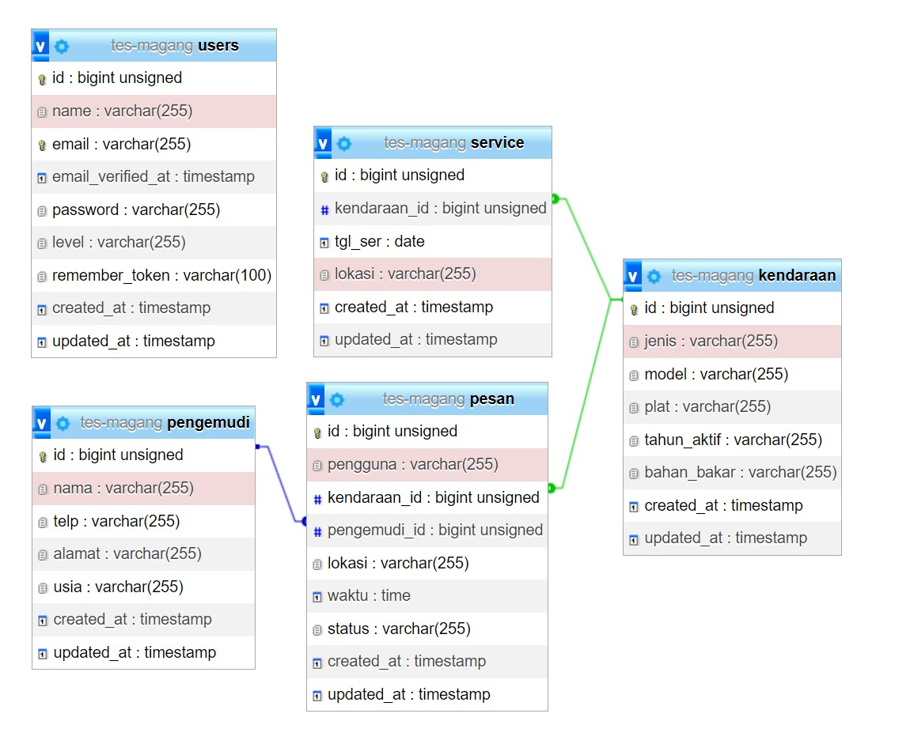
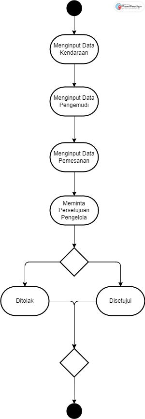

<p align="center"><a href="https://laravel.com" target="_blank"></a></p>

<p align="center">
<a href="https://github.com/laravel/framework/actions"></a>
<a href="https://packagist.org/packages/laravel/framework"></a>
<a href="https://packagist.org/packages/laravel/framework"></a>
<a href="https://packagist.org/packages/laravel/framework"></a>
</p>

## Email & Password 

Jalankan seeder pada terminal

```
php artisan db:seed
```

Login menggunakan email dan password dibawah
```
email : admin@gmail.com
pass  : 12345678

email : pengelola@gmail.com
pass  : 12345678

```

## Information
```
Mysql version : 8.0.30
PHP version : 8.3.4
Framework : Laravel, PHP
```





## Guide
A. Admin
1. Login sebagai Admin.
2. Input data kendaraaan melalui halaman "Kendaraan", pilih "Data Kendaraan" dan tekan button "Tambah Kendaraan", jika data sudah terisi klik simpan.
3. Input data pengemudi melalui halaman "Pengemudi" dan tekan button "Tambah Pengemudi", jika data sudah terisi klik simpan.
4. Input data pemesanan melalui halaman "Pesan Kendaraan" dan tekan tombol plus, jika data sudah terisi klik simpan.
5. Input kendaraan yang akan diservice melaluiu halaman "Kendaraan", pilih "Service Kendaraan" dan tekan button "Tambah Jadwal Service", jika data sudah terisi klik simpan.

B. Pengelola
1. Login sebagai Pengelola.
2. Masuk ke halaman "Pesan Kendaraan", klik tombol "Lihat" kemudian ubah status yang awalnya "Proses" menjadi "Diterima" atau "Ditolak"
